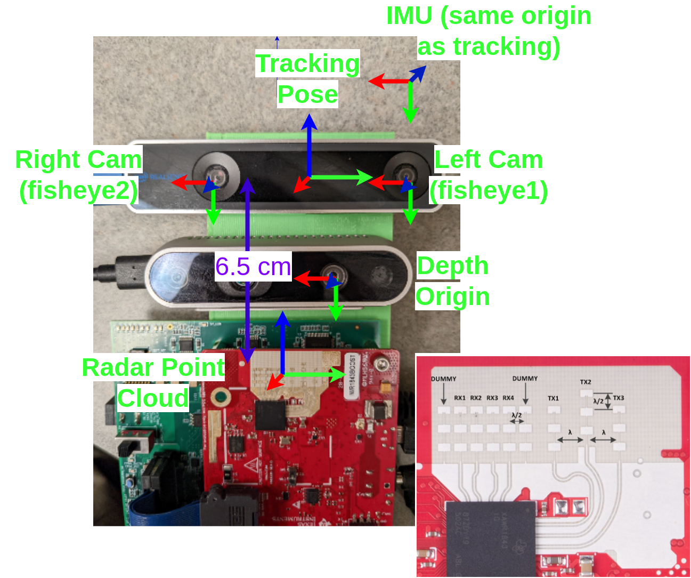

# Sensor Arrangement


# Rosbag Format

```shell script
topics:      /camera/depth/image_rect_raw/compressedDepth    4307 msgs    : sensor_msgs/CompressedImage
             /radar0/radar_data                              1800 msgs    : xwr_raw_ros/RadarFrameFull 
             /ti_mmwave/radar_scan_pcl_0                     1800 msgs    : sensor_msgs/PointCloud2    
             /tracking/fisheye1/image_raw/compressed         1801 msgs    : sensor_msgs/CompressedImage
             /tracking/fisheye2/image_raw/compressed         1800 msgs    : sensor_msgs/CompressedImage
             /tracking/imu                                  11972 msgs    : sensor_msgs/Imu            
             /orb_slam3                                      1787 msgs    : geometry_msgs/PoseStamped  
             /tracking/odom/sample                          11971 msgs    : nav_msgs/Odometry
```

- `/tracking/odom/sample`: T265 VIO baseline/pseudo-groundtruth.
- `/camera/depth/image_rect_raw/compressedDepth`: Depth camera pseudo-groundtruth.
- `/tracking/fisheye1/image_raw/compressed`:  Black-white fisheye image from left camera.
- `/tracking/fisheye2/image_raw/compressed`:  Black-white fisheye image from right camera.
- `/tracking/imu`: Linearly interpolated IMU samples.
- `/ti_mmwave/radar_scan_pcl_0`:  Radar point cloud.
- `/radar0/radar_data`: Raw DSP samples from radar.

